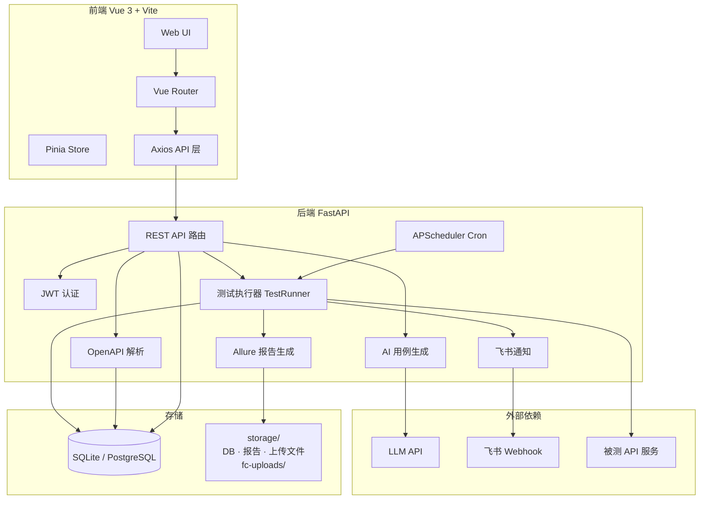

# AITF — AI 测试平台

AI 测试平台 Demo，当前已上线 **接口测试**、**功能用例生成** 与 **性能测试（接口压测）** 三大模块。

## 功能概览

| 模块 | 状态 | 说明 |
|------|------|------|
| 接口测试 | ✅ 已上线 | OpenAPI 解析、Postman 式用例、AI 生成、测试计划、Allure 报告、飞书通知 |
| 功能用例生成 | ✅ 已上线 | 需求文档解析、经验用例导入、双 AI 生成/审查、复查闭环、Excel/XMind 导出 |
| 性能测试 | ✅ 已上线 | JMX 上传解析、并发/Ramp-up/停止条件配置、自研 HTTP 压测引擎、时序指标图表、错误日志 |

---

## 技术架构

### 架构总览

平台采用 **前后端分离**：Vue 3 单页应用负责交互，FastAPI 提供 REST API；Web 层负责 CRUD 与调度，HTTP 测试由 `requests`/`httpx` 同步执行，Allure 报告静态挂载于后端。



### 技术选型

| 层级 | 技术 | 说明 |
|------|------|------|
| 前端框架 | Vue 3 + TypeScript | Composition API，`<script setup>` |
| 构建工具 | Vite 6 | 开发热更新、生产打包 |
| 路由 / 状态 | Vue Router 4 + Pinia 2 | 路由守卫鉴权、全局状态 |
| UI 组件 | Element Plus | 表格、表单、抽屉等后台组件 |
| HTTP 客户端 | Axios | 统一拦截器注入 JWT |
| 后端框架 | FastAPI | 异步 lifespan、自动 OpenAPI 文档 |
| ORM / 迁移 | SQLAlchemy 2.x + Alembic | 模型与版本化迁移 |
| 数据库 | SQLite（Demo）/ PostgreSQL（可选） | 通过 `DATABASE_URL` 切换 |
| 认证 | JWT（HS256） | Bearer Token，bcrypt 密码哈希 |
| 任务调度 | APScheduler | 测试计划 Cron、报告过期清理 |
| 测试执行 | httpx + 自研断言引擎 | 单条/计划批量执行 |
| AI | OpenAI SDK（兼容协议） | 主/备模型降级、Tenacity 重试 |
| 报告 | Allure CLI + 静态挂载 | `/reports` 目录对外服务 |
| 部署 | Docker Compose | 前后端双容器，storage 卷持久化 |

### 核心数据流

1. **OpenAPI 导入**：上传 Swagger/OAS → `openapi_parser` 解析 → upsert 到 `api_endpoints` 表。
2. **用例编辑**：前端 Postman 式编辑器 → REST CRUD → `test_cases` 表（JSON 存 request/assertions）。
3. **单条执行**：选择环境 → `variable_resolver` 替换 `{{var}}` → `test_runner` 发 HTTP → `assertion_engine` 校验 → 返回结果。
4. **AI 生成**：选定接口 → `ai_generator` 调 LLM → 校验候选 → 以 `draft` 状态入库 → 用户确认后激活。
5. **计划执行**：绑定用例 + 选环境 + Cron → APScheduler 触发 → 顺序执行 → 写 Allure → 可选飞书通知。
6. **报告访问**：`allure_service` 生成 HTML → 挂载于 `GET /reports/{run_id}/index.html`。

**功能用例生成（二期）**

7. **需求文档**：上传 TXT/MD/DOCX → `fc_doc_parser` 解析为纯文本 → 存入 `fc_requirement_docs`。
8. **经验用例**：手动录入或 Excel 模板批量导入 → `fc_experience_cases` 表，生成时可勾选注入 Prompt。
9. **双 AI 生成**：选定文档 + 经验用例 → `fc_ai_pipeline` 异步执行 → 生成 AI 产出候选 → 审查 AI 评估覆盖度。
10. **覆盖度门禁**：审查分数 ≥ 80%（可配置）则进入待复查；未达标自动补充，最多 3 轮内部重试。
11. **复查闭环**：预览/编辑 draft 用例 → 确认入库（draft → active）或驳回并填写意见 → 触发再生成。
12. **导出**：active/draft 用例按模块/类型/批次筛选 → 下载 Excel 或 XMind 文件。

### API 路由前缀

| 前缀 | 模块 |
|------|------|
| `/api/v1/auth` | 注册、登录、当前用户 |
| `/api/v1/dashboard` | 首页统计 |
| `/api/v1/projects` | 接口测试项目 CRUD |
| `/api/v1/projects/{id}/apis` | 接口列表、AI 生成 |
| `/api/v1/projects/{id}/openapi` | OpenAPI 文件上传 |
| `/api/v1/projects/{id}/cases` | 测试用例 CRUD、单条执行 |
| `/api/v1/projects/{id}/plans` | 测试计划、绑定、执行、历史 |
| `/api/v1/environments` | 全局环境及变量 |
| `/api/v1/fc-projects` | 功能用例项目 CRUD、项目统计 |
| `/api/v1/fc-projects/{id}/docs` | 需求文档上传、解析、列表 |
| `/api/v1/fc-projects/{id}/experience-cases` | 经验用例 CRUD、Excel 导入 |
| `/api/v1/fc-projects/{id}/generate` | 发起 AI 生成任务 |
| `/api/v1/fc-projects/{id}/batches` | 生成批次、审查报告、确认/驳回 |
| `/api/v1/fc-projects/{id}/cases` | 功能用例 CRUD、筛选、批量删除 |
| `/api/v1/fc-projects/{id}/export` | Excel / XMind 导出 |
| `/health`、`/api/v1/health` | 健康检查 |
| `/reports/*` | Allure 静态报告 |

---

## 环境要求

| 依赖 | 版本建议 |
|------|----------|
| Python | 3.11+ |
| Node.js | 18+ |
| npm | 9+ |
| Docker / Docker Compose | 可选（推荐一键启动） |
| Allure CLI | 可选（本地开发；Docker 镜像已内置） |

## 快速开始（Docker Compose）

```bash
# 1. 克隆仓库并进入目录
cd AITF

# 2. 复制环境变量并按需填写 AI Key
cp .env.example .env

# 3. 启动前后端
docker compose up -d --build

# 4. 访问
# 前端: http://localhost:5173
# 后端: http://localhost:8000
# API 文档: http://localhost:8000/docs
```

> Docker 模式下数据库位于 `storage/aitf.db`，上传文件、Allure 报告与功能用例需求文档均在 `storage/` 目录（需求文档存于 `storage/fc-uploads/`）。

## 本地开发启动

### 1. 环境变量

```bash
cp .env.example .env
```

关键配置项：

| 变量 | 说明 |
|------|------|
| `DATABASE_URL` | 默认 `sqlite:///./storage/aitf.db`（相对路径会解析到项目根目录） |
| `SECRET_KEY` | JWT 签名密钥，生产环境务必修改 |
| `OPENAI_API_KEY` | AI 用例生成所需（兼容 OpenAI 协议，如 DeepSeek） |
| `OPENAI_BASE_URL` | LLM API 地址 |
| `AI_MODEL` | 接口测试 AI 主模型 |
| `AI_FALLBACK_MODEL` | 接口测试 AI 备用模型 |
| `AI_FC_MODEL` | 功能用例 AI 主模型（留空则复用 `AI_MODEL`） |
| `AI_FC_FALLBACK_MODEL` | 功能用例 AI 备用模型 |
| `FC_COVERAGE_THRESHOLD` | 审查覆盖度门禁阈值，默认 `80.0` |
| `FC_MAX_INTERNAL_RETRY` | 未达标时内部自动补充轮次，默认 `3` |
| `FC_MAX_DOC_SIZE_MB` | 单份需求文档大小上限，默认 `10` |
| `PT_MAX_CONCURRENCY` | 压测最大并发上限，默认 `1000` |
| `PT_METRICS_FLUSH_INTERVAL_SECONDS` | 时序指标落库间隔（秒），默认 `3` |
| `PT_RUN_RETENTION_DAYS` | 运行记录保留天数，默认 `30` |
| `REPORT_BASE_URL` | Allure 报告外链前缀 |
| `VITE_API_BASE_URL` | 前端请求后端的 Base URL |

### 2. 后端

```bash
cd backend
python3.11 -m venv .venv
source .venv/bin/activate   # Windows: .venv\Scripts\activate
pip install -r requirements.txt

# 数据库迁移
alembic upgrade head

# 启动（建议带 reload）
uvicorn app.main:app --host 127.0.0.1 --port 8000 --reload
```

健康检查：`GET http://localhost:8000/health`

### 3. 前端

```bash
cd frontend
npm install
npm run dev
```

访问：http://localhost:5173

也可使用项目根目录一键脚本（迁移 + 前后端后台启动）：

```bash
bash scripts/start-dev.sh
```

## Demo 账号

平台无预置账号，首次使用请在 **注册页** 自行创建，或使用 seed 脚本（见下方「Demo 数据」）初始化。

推荐 Demo 账号（手动注册或 seed 后登录）：

| 字段 | 值 |
|------|-----|
| 用户名 | `demo` |
| 密码 | `Demo123456` |

## Demo 走查（接口测试模块）

详细逐步验收清单见 **[docs/demo/DEMO_CHECKLIST.md](./docs/demo/DEMO_CHECKLIST.md)**。

快速路径：

1. 登录 → 首页选择 **接口测试**
2. 进入 **Demo 商城 API**（或新建接口项目并上传 Swagger）
3. 确认 **环境变量** 中 `dev.base_url` 已配置
4. 单条执行用例，或使用 **AI 生成** draft 用例并确认入库
5. 打开 **Demo 冒烟计划**（或新建计划），绑定用例，配置 Cron
6. 手动执行计划 → 查看 Allure 报告 → 检查飞书通知（可选）

## Demo 走查（功能用例生成模块）

> 需配置 `.env` 中 `OPENAI_API_KEY` 等 LLM 相关变量；生成过程为后台异步任务，前端会轮询批次状态。

快速路径：

1. 登录 → 首页选择 **功能用例生成**
2. 新建功能项目 → 进入项目详情
3. **需求文档** Tab：上传 TXT / MD / DOCX，确认解析状态为「成功」
4. **经验用例** Tab（可选）：手动录入，或下载 Excel 模板批量导入
5. **AI 生成** Tab：选择已解析文档 → 勾选经验用例（可选）→ 发起生成 → 等待批次完成
6. **审阅** Tab：查看审查报告与 draft 候选用例 → 编辑单条 → **确认入库** 或 **驳回再生成**
7. **用例库** Tab：查看 active 正式用例 → 按模块/类型筛选 → 导出 Excel 或 XMind
8. **历史** Tab：查看各生成批次状态与审查报告详情

**已知限制（规划中）**：PDF 需求文档解析、经验用例标签分类、首页功能用例统计。

## Demo 走查（性能测试模块）

详细逐步验收清单见 **[docs/demo/PT_DEMO_CHECKLIST.md](./docs/demo/PT_DEMO_CHECKLIST.md)**。

> 压测目标需可公网访问；Seed 脚本已内置 `jsonplaceholder.typicode.com` 示例，可直接演示。全局同时仅允许 **1 个** running 压测任务。

快速路径：

1. 登录 → 首页选择 **性能测试**
2. 进入 **Demo 压测项目**（或新建压测项目 → 新建压测详情）
3. **压测详情** Tab：确认场景 **JSONPlaceholder Demo** 已解析出 3 个 HTTP 接口（List Users / Get User / Create Post）
4. 点击 **配置脚本**：确认默认参数（并发 10、Ramp-up 5s、时长 30s）→ 保存
5. 点击 **运行** → 自动跳转运行详情页
6. 观察 **时序指标** 折线图约 3–7 秒后开始刷新；**接口汇总指标** 在运行中实时更新
7. 可选：点击 **取消压测** → 状态变为「已取消」，曲线与快照保留
8. **运行记录** Tab：查看历史 run 列表 → 点击进入详情回看完整曲线与错误日志

**手动上传 JMX 提示**：若脚本使用 **HTTP Request Defaults** 配置域名/端口，重新上传后平台会自动合并为完整 URL；仅相对 path 且无 Defaults 的请求会 100% 失败。

## Demo 数据

示例 Swagger 与 seed 脚本：

```bash
cd backend
source .venv/bin/activate
alembic upgrade head
python scripts/seed_demo.py
```

| 资源 | 路径 |
|------|------|
| 示例 OpenAPI | `docs/demo/demo-openapi.json` |
| 示例 JMX | `docs/demo/demo-load-test.jmx` |
| Seed 脚本 | `backend/scripts/seed_demo.py` |
| 一键启动 | `scripts/start-dev.sh` |

Seed 将创建：

- 用户 `demo / Demo123456`
- 环境 `dev`（`base_url=https://jsonplaceholder.typicode.com`）
- 接口项目 **Demo 商城 API**（4 个接口、2 条用例、1 个测试计划）
- 压测项目 **Demo 压测项目**（1 个场景、已上传并解析 demo JMX，默认 30s 时长压测）

脚本可重复执行（幂等），已存在的数据会跳过或更新。

## 运行测试

```bash
cd backend
source .venv/bin/activate
pytest -q
```

---

## 目录结构与文件说明

### 项目根目录

| 文件 / 目录 | 作用 |
|-------------|------|
| `docker-compose.yml` | 编排 backend + frontend 双服务，挂载 `storage/` 与 `.env` |
| `.env.example` | 环境变量模板（数据库、JWT、LLM、Allure 等） |
| `.gitignore` | 忽略虚拟环境、`storage/`、IDE 配置等 |
| `architecture.md` | 一期接口测试架构设计文档 |
| `architecture2.md` | 二期功能用例生成架构设计文档 |
| `architecture3.md` | 三期性能测试架构设计文档 |
| `tasks2.md` | 二期功能用例生成任务清单与验收标准 |
| `tasks3.md` | 三期性能测试任务清单与验收标准 |
| `storage/` | 运行时数据目录（gitignore）：SQLite DB、Allure 报告、OpenAPI / 需求文档上传文件 |
| `docs/demo/` | Demo 资源：示例 OpenAPI/JMX、接口/压测验收清单等 |

---

### 后端 `backend/`

#### 入口与配置

| 文件 | 作用 |
|------|------|
| `requirements.txt` | Python 依赖清单（FastAPI、SQLAlchemy、APScheduler、OpenAI、python-docx、openpyxl 等） |
| `Dockerfile` | 后端镜像：Python 3.11 + 内置 Allure CLI + JRE |
| `entrypoint.sh` | 容器启动：执行 `alembic upgrade head` 后启动 uvicorn |
| `.dockerignore` | Docker 构建排除项 |
| `alembic.ini` | Alembic 迁移工具配置 |
| `scripts/seed_demo.py` | CLI 入口：调用 `demo_seed_service` 初始化 Demo 数据 |

#### `backend/app/` — 应用主代码

##### 根级

| 文件 | 作用 |
|------|------|
| `main.py` | FastAPI 应用入口：注册路由、CORS、lifespan（Allure 检测 + 启动调度器）、挂载 `/reports` 静态目录 |
| `config.py` | Pydantic Settings：读取 `.env`，解析 SQLite 路径、CORS、LLM、Allure、调度时区等 |
| `database.py` | SQLAlchemy `Base` 与 `get_db()` 依赖注入（Session 生命周期） |

##### `app/core/` — 认证与依赖

| 文件 | 作用 |
|------|------|
| `security.py` | bcrypt 密码哈希/校验；JWT 签发与解码 |
| `deps.py` | `get_current_user` 依赖：从 Bearer Token 解析当前用户 |

##### `app/models/` — SQLAlchemy ORM 模型

| 文件 | 作用 |
|------|------|
| `__init__.py` | 统一导出所有模型，供 Alembic 与业务层引用 |
| `user.py` | 用户表：username、password_hash |
| `project.py` | 接口测试项目：name、description、feishu_webhook_url、created_by |
| `fc_project.py` | 功能用例项目：name、description、created_by |
| `fc_requirement_doc.py` | 需求文档：文件名、解析状态、parsed_text |
| `fc_experience_case.py` | 经验用例：模块、步骤、优先级、类型 |
| `fc_test_case.py` | 功能用例：步骤文本、status（active/draft）、关联生成批次 |
| `fc_generation_batch.py` | 生成批次：状态机、审查报告 JSON、覆盖度分数 |
| `api_endpoint.py` | 从 OpenAPI 解析的接口：method、path、parameters/request/responses JSON |
| `environment.py` | 全局环境 `Environment` 及键值对 `EnvironmentVariable` |
| `test_case.py` | 测试用例：关联 project/api_endpoint，JSON 存 request 与 assertions，status（active/draft） |
| `test_plan.py` | 测试计划 `TestPlan`、用例绑定 `PlanCase`、执行记录 `PlanRun` |

##### `app/schemas/` — Pydantic 请求/响应模型

| 文件 | 作用 |
|------|------|
| `auth.py` | 注册、登录请求；Token、User 响应 |
| `project.py` | 项目 CRUD 请求与响应 |
| `fc_project.py` | 功能用例项目 CRUD 请求与响应、项目统计 |
| `fc_requirement_doc.py` | 需求文档上传/列表/详情响应 |
| `fc_experience_case.py` | 经验用例 CRUD、Excel 导入响应 |
| `fc_test_case.py` | 功能用例 CRUD、筛选、批量删除 |
| `fc_generation.py` | 生成请求/响应、批次确认/驳回、审查报告 Schema |
| `api_endpoint.py` | 接口列表/详情响应；OpenAPI 上传响应 |
| `environment.py` | 环境 CRUD、变量批量保存的请求/响应及字段校验 |
| `test_case.py` | 用例 CRUD、请求/断言 JSON Schema、单条执行结果响应 |
| `test_plan.py` | 计划 CRUD、用例绑定、执行历史响应 |
| `ai_generation.py` | AI 生成请求/响应；LLM 输出候选的结构化校验 Schema |
| `dashboard.py` | 首页统计：项目数、用例数、计划数等 |

##### `app/api/` — REST 路由层

| 文件 | 作用 |
|------|------|
| `auth.py` | `POST /register`、`POST /login`、`GET /me` |
| `dashboard.py` | `GET /stats` 首页仪表盘数据 |
| `projects.py` | 接口测试项目 CRUD |
| `fc_projects.py` | 功能用例项目 CRUD、项目统计 |
| `fc_requirement_docs.py` | 需求文档上传、解析、列表、删除 |
| `fc_experience_cases.py` | 经验用例 CRUD、Excel 模板下载与导入 |
| `fc_generation.py` | `POST .../generate` 发起 AI 生成（后台异步） |
| `fc_generation_batches.py` | 批次列表/详情、候选用例、确认入库、驳回再生成 |
| `fc_test_cases.py` | 功能用例 CRUD、筛选、批量删除 |
| `fc_export.py` | `GET .../excel`、`GET .../xmind` 导出下载 |
| `api_endpoints.py` | 接口列表/详情/删除；`POST .../ai-generate` 触发 AI 生成 |
| `openapi.py` | `POST .../upload` 上传并解析 OpenAPI 文件 |
| `test_cases.py` | 用例 CRUD；`POST .../confirm` 确认 draft；`POST .../run` 单条执行 |
| `test_plans.py` | 计划 CRUD；绑定/解绑用例；手动执行；执行历史列表 |
| `environments.py` | 环境 CRUD；环境变量的查询与批量保存 |

##### `app/services/` — 业务逻辑层

| 文件 | 作用 |
|------|------|
| `openapi_parser.py` | 解析 JSON/YAML OpenAPI；保存上传文件；抽取 paths 为 `ParsedApiEndpoint` |
| `api_endpoint_service.py` | 将解析结果 upsert 到 `api_endpoints` 表 |
| `ai_generator.py` | 构建 Prompt、调用 LLM（重试+降级）、解析 JSON 候选、校验并保存 draft 用例 |
| `variable_resolver.py` | `{{var}}` 模板替换；Docker 下 localhost 重写为 `host.docker.internal` |
| `assertion_engine.py` | 断言评估：status_code、response_time、body contains/json_path 规则 |
| `test_runner.py` | 核心执行器：组装请求、发 HTTP、跑断言；支持单条与计划批量执行 |
| `test_plan_service.py` | 计划用例绑定校验（容量、active 状态） |
| `plan_execution_service.py` | 计划执行编排：创建 PlanRun、顺序跑用例、写 Allure、发飞书 |
| `allure_service.py` | Allure 结果写入、CLI 生成 HTML 报告、fallback 简易 HTML |
| `feishu_notifier.py` | 计划完成后向飞书 Webhook 发送文本消息 |
| `cron_validator.py` | Cron 表达式校验；Unix/标准 cron 转 APScheduler 触发器 |
| `dashboard_service.py` | 聚合各表计数，返回仪表盘统计 |
| `demo_seed_service.py` | Demo 数据幂等 seed：用户、环境、接口/功能/压测项目及示例 JMX |
| `report_cleanup_service.py` | 按保留天数清理过期 PlanRun 及磁盘报告文件 |
| `fc_doc_parser.py` | 解析 TXT/MD/DOCX 需求文档为纯文本 |
| `fc_experience_importer.py` | 经验用例 Excel 模板校验与批量导入 |
| `fc_ai_generator.py` | 功能用例生成 AI：Prompt 构建、LLM 调用、JSON 校验 |
| `fc_ai_reviewer.py` | 审查 AI：覆盖度评估、审查报告生成 |
| `fc_ai_pipeline.py` | 双 AI 流水线编排：生成 → 审查 → 门禁 → 内部重试 |
| `fc_exporter.py` | 功能用例导出为 Excel / XMind |

##### `app/scheduler/` — 定时任务

| 文件 | 作用 |
|------|------|
| `plan_jobs.py` | 启动 APScheduler；同步各 TestPlan 的 Cron Job；定时触发 `execute_test_plan` |
| `report_cleanup_jobs.py` | 注册每日报告清理 Job |

#### `backend/alembic/` — 数据库迁移

| 文件 | 作用 |
|------|------|
| `env.py` | Alembic 运行环境：绑定 `database_url` 与模型 metadata |
| `script.py.mako` | 新迁移文件的 Jinja 模板 |
| `README` | Alembic 使用说明 |
| `versions/15551ce56419_create_users_table.py` | 创建 `users` 表 |
| `versions/e730124de194_create_projects_table.py` | 创建 `projects` 表 |
| `versions/004909dc6f91_create_api_endpoints_table.py` | 创建 `api_endpoints` 表 |
| `versions/1869912c614f_create_environment_tables.py` | 创建 `environments`、`environment_variables` 表 |
| `versions/19497bdfb2e9_create_test_cases_table.py` | 创建 `test_cases` 表 |
| `versions/b7c2d1e4f908_create_test_plan_tables.py` | 创建 `test_plans`、`plan_cases`、`plan_runs` 表 |
| `versions/c3a8f2b1d904_add_notify_on_complete_to_test_plans.py` | 为测试计划增加 `notify_on_complete` 字段 |
| `versions/d4e5f6a7b890_create_fc_projects_table.py` | 创建 `fc_projects` 表 |
| `versions/e5f6a7b8c901_create_fc_requirement_docs_table.py` | 创建 `fc_requirement_docs` 表 |
| `versions/f6a7b8c9d012_create_fc_experience_cases_table.py` | 创建 `fc_experience_cases` 表 |
| `versions/a7b8c9d0e123_create_fc_test_case_tables.py` | 创建 `fc_test_cases`、`fc_generation_batches` 表 |

#### `backend/docker/allure/` — 内置 Allure CLI

Docker 镜像内置的 Allure 命令行发行包（bin、plugins、config），本地开发可改用系统安装的 Allure。

#### `backend/tests/` — pytest 单元测试

| 文件 | 测试对象 |
|------|----------|
| `conftest.py` | 共享 fixture：内存 SQLite、TestClient、认证头 |
| `test_health.py` | 健康检查端点 |
| `test_cors.py` | CORS 头配置 |
| `test_config.py` | Settings 与数据库 URL 解析 |
| `test_auth.py` | 注册、登录、JWT 校验 |
| `test_user_model.py` | User 模型 |
| `test_projects.py` | 项目 API |
| `test_fc_projects.py` | 功能用例项目 API |
| `test_dashboard.py` | 仪表盘统计 API |
| `test_environments.py` | 环境 CRUD 与变量 API |
| `test_environment_model.py` | Environment 模型 |
| `test_api_endpoints.py` | 接口列表/删除/AI 生成 API |
| `test_api_endpoint_model.py` | ApiEndpoint 模型 |
| `test_api_endpoint_service.py` | 接口 upsert 服务 |
| `test_openapi_parser.py` | OpenAPI 解析逻辑 |
| `test_openapi_upload.py` | OpenAPI 上传 API |
| `test_test_cases.py` | 用例 CRUD API |
| `test_test_case_model.py` | TestCase 模型 |
| `test_test_case_run.py` | 单条用例执行 API |
| `test_test_plans.py` | 测试计划 CRUD、绑定、执行 API |
| `test_test_plan_model.py` | TestPlan / PlanRun 模型 |
| `test_test_plan_service.py` | 计划用例绑定校验 |
| `test_plan_execution.py` | 计划执行编排 |
| `test_test_runner.py` | HTTP 执行与断言集成 |
| `test_assertion_engine.py` | 断言引擎各规则 |
| `test_variable_resolver.py` | 变量替换与 localhost 重写 |
| `test_cron_validator.py` | Cron 表达式校验 |
| `test_ai_generator.py` | AI 生成服务（Mock LLM） |
| `test_ai_generate.py` | AI 生成 API 端点 |
| `test_ai_generation_schema.py` | AI 输出 Schema 校验 |
| `test_allure_service.py` | Allure 报告写入与生成 |
| `test_feishu_notifier.py` | 飞书通知（Mock HTTP） |
| `test_report_cleanup.py` | 报告清理服务 |
| `test_report_cleanup_jobs.py` | 报告清理定时 Job |
| `test_seed_demo.py` | Demo seed 脚本 |
| `test_fc_requirement_docs.py` | 需求文档上传与解析 API |
| `test_fc_doc_parser.py` | 需求文档解析服务 |
| `test_fc_experience_cases.py` | 经验用例 CRUD API |
| `test_fc_experience_importer.py` | 经验用例 Excel 导入 |
| `test_fc_generation.py` | AI 生成 API |
| `test_fc_ai_generator.py` | 生成 AI 服务（Mock LLM） |
| `test_fc_ai_pipeline.py` | 双 AI 流水线（Mock LLM） |
| `test_fc_review_flow.py` | 复查确认/驳回流程 |
| `test_fc_test_cases.py` | 功能用例 CRUD API |
| `test_fc_exporter.py` | Excel/XMind 导出服务 |
| `test_fc_export_api.py` | 导出 API 端点 |

---

### 前端 `frontend/`

#### 根级配置

| 文件 | 作用 |
|------|------|
| `package.json` | 依赖与脚本：`dev` / `build` / `preview` |
| `package-lock.json` | 锁定依赖版本 |
| `vite.config.ts` | Vite 配置：`@` 路径别名、开发端口 5173 |
| `tsconfig.json` | TypeScript 编译选项（应用代码） |
| `tsconfig.node.json` | TypeScript 编译选项（Vite 配置文件） |
| `env.d.ts` | Vite 环境变量类型声明（`import.meta.env`） |
| `index.html` | SPA 入口 HTML，挂载 `#app` |
| `Dockerfile` | 多阶段构建：Node 打包 → Nginx 静态服务 |
| `nginx.conf` | 生产 Nginx：`try_files` 支持 Vue Router history 模式 |
| `.dockerignore` | Docker 构建排除项 |
| `public/vite.svg` | 静态资源（favicon 等） |

#### `frontend/src/` — 应用源码

##### 入口与布局

| 文件 | 作用 |
|------|------|
| `main.ts` | 创建 Vue 应用，注册 Pinia、Router、Element Plus |
| `App.vue` | 根组件：`<RouterView />` 与全局基础样式 |
| `router/index.ts` | 路由表、嵌套路由、登录鉴权守卫（`requiresAuth` / `guestOnly`） |
| `components/layout/AppShell.vue` | 登录后主布局：顶栏导航、侧边菜单、`<RouterView />` 内容区 |

##### `src/stores/` — Pinia 状态

| 文件 | 作用 |
|------|------|
| `auth.ts` | 登录/注册/登出、Token 持久化、当前用户、`isAuthenticated` |
| `app.ts` | 全局 UI 状态（如侧边栏折叠等轻量状态） |

##### `src/api/` — 后端 API 封装

| 文件 | 作用 |
|------|------|
| `request.ts` | Axios 实例：Base URL、JWT 注入、401 自动跳转登录 |
| `auth.ts` | 注册、登录、获取当前用户 |
| `dashboard.ts` | 首页统计数据 |
| `projects.ts` | 接口测试项目 CRUD |
| `fc-projects.ts` | 功能用例项目 CRUD、项目统计 |
| `fc-requirement-docs.ts` | 需求文档上传、列表、详情、删除 |
| `fc-experience-cases.ts` | 经验用例 CRUD、Excel 模板下载与导入 |
| `fc-generation.ts` | 发起生成、批次轮询、确认/驳回 |
| `fc-test-cases.ts` | 功能用例 CRUD、筛选、批量删除 |
| `fc-export.ts` | Excel / XMind 导出下载 |
| `form-upload.ts` | multipart 表单上传辅助 |
| `apiEndpoints.ts` | 接口列表/详情/删除、AI 生成 |
| `testCases.ts` | 用例 CRUD、确认 draft、单条执行 |
| `testPlans.ts` | 计划 CRUD、绑定用例、执行、历史 |
| `environments.ts` | 环境 CRUD、变量读写 |
| `health.ts` | 健康检查 |

##### `src/utils/` — 工具函数

| 文件 | 作用 |
|------|------|
| `auth-storage.ts` | localStorage 读写 JWT Token |
| `datetime.ts` | 日期时间格式化展示 |
| `cron.ts` | Cron 表达式前端校验与展示辅助 |

##### `src/components/` — 可复用组件

| 文件 | 作用 |
|------|------|
| `common/AsyncState.vue` | 通用异步加载/空态/错误态展示 |
| `apis/ApiEndpointDetailDrawer.vue` | 接口详情抽屉：参数、请求体、响应 Schema |
| `apis/AiGenerateDialog.vue` | AI 生成用例对话框：选接口、预览 draft、确认入库 |
| `testcases/TestCaseRequestEditor.vue` | Postman 式请求编辑器：URL、Method、Headers、Body |
| `testcases/TestCaseAssertionsEditor.vue` | 断言编辑器：状态码、耗时、Body 规则 |
| `testcases/TestCaseRunResultDrawer.vue` | 单条执行结果抽屉：请求/响应/断言明细 |
| `testcases/AiDraftCasePreviewDrawer.vue` | AI 生成候选用例预览抽屉 |
| `fc/FcReviewReportPanel.vue` | 功能用例审查报告展示面板 |

##### `src/views/` — 页面视图

**认证与首页**

| 文件 | 作用 |
|------|------|
| `LoginView.vue` | 登录页 |
| `RegisterView.vue` | 注册页 |
| `HomeView.vue` | 首页：模块入口卡片、仪表盘统计 |

**全局环境**

| 文件 | 作用 |
|------|------|
| `environments/EnvironmentView.vue` | 环境管理：CRUD、键值对变量编辑 |

**接口测试 — 项目**

| 文件 | 作用 |
|------|------|
| `projects/ProjectListView.vue` | 接口测试项目列表 |
| `projects/ProjectDetailView.vue` | 项目详情壳：Tab 导航容器 |
| `projects/TestCaseEditorView.vue` | 用例新建/编辑页（独立路由） |
| `projects/ProjectPlanDetailView.vue` | 测试计划详情：绑定用例、Cron、执行、历史报告 |
| `projects/tabs/ProjectOverviewTab.vue` | 项目概览 Tab |
| `projects/tabs/ProjectApisTab.vue` | 接口列表 Tab：上传 OpenAPI、查看接口、触发 AI |
| `projects/tabs/ProjectCasesTab.vue` | 用例列表 Tab：筛选、执行、跳转编辑 |
| `projects/tabs/ProjectPlansTab.vue` | 测试计划列表 Tab |
| `projects/tabs/ProjectAiReviewTab.vue` | AI 生成用例审阅 Tab |
| `projects/tabs/ProjectSettingsTab.vue` | 项目设置 Tab：名称、飞书 Webhook 等 |
| `projects/tabs/ProjectPlaceholderTab.vue` | 占位 Tab（预留扩展） |

**功能用例生成 — 项目**

| 文件 | 作用 |
|------|------|
| `fc-projects/FcProjectListView.vue` | 功能用例项目列表、创建弹窗 |
| `fc-projects/FcProjectDetailView.vue` | 功能用例项目详情壳：Tab 导航 |
| `fc-projects/tabs/FcOverviewTab.vue` | 项目概览：文档/经验/用例/批次统计 |
| `fc-projects/tabs/FcRequirementDocsTab.vue` | 需求文档上传、解析状态、文本预览 |
| `fc-projects/tabs/FcExperienceCasesTab.vue` | 经验用例录入、编辑、Excel 导入 |
| `fc-projects/tabs/FcGenerateTab.vue` | 选择文档与经验用例，发起 AI 生成 |
| `fc-projects/tabs/FcReviewTab.vue` | 审查报告、draft 预览/编辑、确认/驳回 |
| `fc-projects/tabs/FcCasesTab.vue` | 正式用例库：筛选、批量删除、导出 |
| `fc-projects/tabs/FcHistoryTab.vue` | 生成批次历史与审查报告 |
| `fc-projects/tabs/FcPlaceholderTab.vue` | 通用占位 Tab 组件（预留扩展） |

---

## 常见问题

**Q: `/api/v1/dashboard/stats` 返回 404？**  
A: 后端代码更新后需重启 uvicorn；Docker 模式需 `docker compose up -d --build backend`。

**Q: AI 生成失败？**  
A: 检查 `.env` 中 `OPENAI_API_KEY`、`OPENAI_BASE_URL`、`AI_MODEL` 是否配置正确。

**Q: Allure 报告为 fallback HTML？**  
A: 本地需安装 Allure CLI 并配置 `ALLURE_CLI`；Docker 镜像已内置。

**Q: 用例执行请求不到 localhost 上的被测服务？**  
A: Docker 后端运行时，环境变量中设置 `RUNNER_HOST_ALIAS=host.docker.internal`。

**Q: 功能用例 AI 生成一直 pending？**  
A: 检查后端日志与 `.env` 中 LLM 配置；生成任务为后台异步，需等待批次状态变为 `pending_review` 或 `failed`。

**Q: 需求文档上传后解析失败？**  
A: 支持 TXT/MD/DOCX；复杂 DOCX 排版建议转为 Markdown 后重试；单文件默认上限 10MB。

**Q: 审查覆盖度未达标会怎样？**  
A: 系统自动触发内部补充（最多 3 轮）；仍不达标则批次标记失败，可修改需求/经验用例后重新生成。

---

> 更完整的模块设计见 **[architecture.md](./architecture.md)**（接口测试）与 **[architecture2.md](./architecture2.md)**（功能用例生成）。
