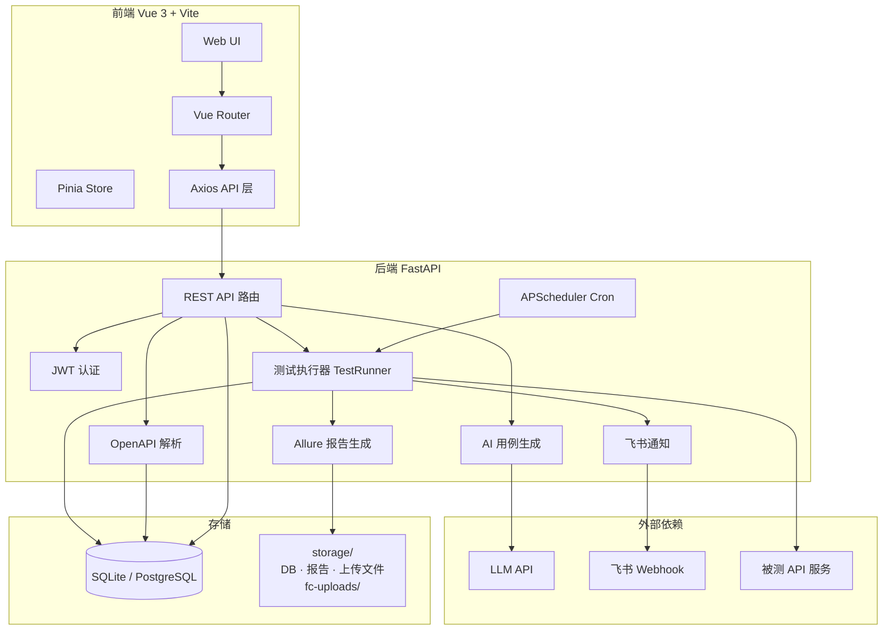

# AITF — AI 测试平台

AI 测试平台 Demo，当前已上线 **接口测试**、**功能用例生成** 与 **性能测试（接口压测）** 三大模块。

## 功能概览

| 模块 | 状态 | 说明 |
|------|------|------|
| 接口测试 | ✅ 已上线 | OpenAPI 解析、Postman 式用例、AI 生成、测试计划、Allure 报告、飞书通知 |
| 功能用例生成 | ✅ 已上线 | 需求文档解析、经验用例导入、双 AI 生成/审查、复查闭环、Excel/XMind 导出 |
| 性能测试 | ✅ 已上线 | JMX 上传解析、并发/Ramp-up/停止条件配置、自研 HTTP 压测引擎、时序指标图表、错误日志 |
| UI测试 | ⏳ 未上线 | 可视化录制与回放，覆盖端到端 UI 自动化场景 |
| AI产品评测 | ⏳ 未上线 | 评测流水线、效果评估 |
| 造数工具 | ⏳ 未上线 | 按规则批量构造测试数据，支撑联调与回归准备 |

---

## 技术架构

### 架构总览

平台采用 **前后端分离**：Vue 3 单页应用负责交互，FastAPI 提供 REST API；Web 层负责 CRUD 与调度，HTTP 测试由 `requests`/`httpx` 同步执行，Allure 报告静态挂载于后端。



### 技术选型

| 层级 | 技术 | 说明 |
|------|------|------|
| 前端框架 | Vue 3 + TypeScript | Composition API，`<script setup>` |
| 构建工具 | Vite 6 | 开发热更新、生产打包 |
| 路由 / 状态 | Vue Router 4 + Pinia 2 | 路由守卫鉴权、全局状态 |
| UI 组件 | Element Plus | 表格、表单、抽屉等后台组件 |
| HTTP 客户端 | Axios | 统一拦截器注入 JWT |
| 后端框架 | FastAPI | 异步 lifespan、自动 OpenAPI 文档 |
| ORM / 迁移 | SQLAlchemy 2.x + Alembic | 模型与版本化迁移 |
| 数据库 | SQLite（Demo）/ PostgreSQL（可选） | 通过 `DATABASE_URL` 切换 |
| 认证 | JWT（HS256） | Bearer Token，bcrypt 密码哈希 |
| 任务调度 | APScheduler | 测试计划 Cron、报告过期清理 |
| 测试执行 | httpx + 自研断言引擎 | 单条/计划批量执行 |
| AI | OpenAI SDK（兼容协议） | 主/备模型降级、Tenacity 重试 |
| 报告 | Allure CLI + 静态挂载 | `/reports` 目录对外服务 |
| 部署 | Docker Compose | 前后端双容器，storage 卷持久化 |

### 核心数据流

1. **OpenAPI 导入**：上传 Swagger/OAS → `openapi_parser` 解析 → upsert 到 `api_endpoints` 表。
2. **用例编辑**：前端 Postman 式编辑器 → REST CRUD → `test_cases` 表（JSON 存 request/assertions）。
3. **单条执行**：选择环境 → `variable_resolver` 替换 `{{var}}` → `test_runner` 发 HTTP → `assertion_engine` 校验 → 返回结果。
4. **AI 生成**：选定接口 → `ai_generator` 调 LLM → 校验候选 → 以 `draft` 状态入库 → 用户确认后激活。
5. **计划执行**：绑定用例 + 选环境 + Cron → APScheduler 触发 → 顺序执行 → 写 Allure → 可选飞书通知。
6. **报告访问**：`allure_service` 生成 HTML → 挂载于 `GET /reports/{run_id}/index.html`。

**功能用例生成（二期）**

7. **需求文档**：上传 TXT/MD/DOCX → `fc_doc_parser` 解析为纯文本 → 存入 `fc_requirement_docs`。
8. **经验用例**：手动录入或 Excel 模板批量导入 → `fc_experience_cases` 表，生成时可勾选注入 Prompt。
9. **双 AI 生成**：选定文档 + 经验用例 → `fc_ai_pipeline` 异步执行 → 生成 AI 产出候选 → 审查 AI 评估覆盖度。
10. **覆盖度门禁**：审查分数 ≥ 80%（可配置）则进入待复查；未达标自动补充，最多 3 轮内部重试。
11. **复查闭环**：预览/编辑 draft 用例 → 确认入库（draft → active）或驳回并填写意见 → 触发再生成。
12. **导出**：active/draft 用例按模块/类型/批次筛选 → 下载 Excel 或 XMind 文件。

### API 路由前缀

| 前缀 | 模块 |
|------|------|
| `/api/v1/auth` | 注册、登录、当前用户 |
| `/api/v1/dashboard` | 首页统计 |
| `/api/v1/projects` | 接口测试项目 CRUD |
| `/api/v1/projects/{id}/apis` | 接口列表、AI 生成 |
| `/api/v1/projects/{id}/openapi` | OpenAPI 文件上传 |
| `/api/v1/projects/{id}/cases` | 测试用例 CRUD、单条执行 |
| `/api/v1/projects/{id}/plans` | 测试计划、绑定、执行、历史 |
| `/api/v1/environments` | 全局环境及变量 |
| `/api/v1/fc-projects` | 功能用例项目 CRUD、项目统计 |
| `/api/v1/fc-projects/{id}/docs` | 需求文档上传、解析、列表 |
| `/api/v1/fc-projects/{id}/experience-cases` | 经验用例 CRUD、Excel 导入 |
| `/api/v1/fc-projects/{id}/generate` | 发起 AI 生成任务 |
| `/api/v1/fc-projects/{id}/batches` | 生成批次、审查报告、确认/驳回 |
| `/api/v1/fc-projects/{id}/cases` | 功能用例 CRUD、筛选、批量删除 |
| `/api/v1/fc-projects/{id}/export` | Excel / XMind 导出 |
| `/health`、`/api/v1/health` | 健康检查 |
| `/reports/*` | Allure 静态报告 |

---

## 环境要求

| 依赖 | 版本建议 |
|------|----------|
| Python | 3.11+ |
| Node.js | 18+ |
| npm | 9+ |
| Docker / Docker Compose | 可选（推荐一键启动） |
| Allure CLI | 可选（本地开发；Docker 镜像已内置） |

## 快速开始（Docker Compose）

```bash
# 1. 克隆仓库并进入目录
cd AITF

# 2. 复制环境变量并按需填写 AI Key
cp .env.example .env

# 3. 启动前后端
docker compose up -d --build

# 4. 访问
# 前端: http://localhost:5173
# 后端: http://localhost:8000
# API 文档: http://localhost:8000/docs
```

> Docker 模式下数据库位于 `storage/aitf.db`，上传文件、Allure 报告与功能用例需求文档均在 `storage/` 目录（需求文档存于 `storage/fc-uploads/`）。

## 本地开发启动

### 1. 环境变量

```bash
cp .env.example .env
```

关键配置项：

| 变量 | 说明 |
|------|------|
| `DATABASE_URL` | 默认 `sqlite:///./storage/aitf.db`（相对路径会解析到项目根目录） |
| `SECRET_KEY` | JWT 签名密钥，生产环境务必修改 |
| `OPENAI_API_KEY` | AI 用例生成所需（兼容 OpenAI 协议，如 DeepSeek） |
| `OPENAI_BASE_URL` | LLM API 地址 |
| `AI_MODEL` | 接口测试 AI 主模型 |
| `AI_FALLBACK_MODEL` | 接口测试 AI 备用模型 |
| `AI_FC_MODEL` | 功能用例 AI 主模型（留空则复用 `AI_MODEL`） |
| `AI_FC_FALLBACK_MODEL` | 功能用例 AI 备用模型 |
| `FC_COVERAGE_THRESHOLD` | 审查覆盖度门禁阈值，默认 `80.0` |
| `FC_MAX_INTERNAL_RETRY` | 未达标时内部自动补充轮次，默认 `3` |
| `FC_MAX_DOC_SIZE_MB` | 单份需求文档大小上限，默认 `10` |
| `PT_MAX_CONCURRENCY` | 压测最大并发上限，默认 `1000` |
| `PT_METRICS_FLUSH_INTERVAL_SECONDS` | 时序指标落库间隔（秒），默认 `3` |
| `PT_RUN_RETENTION_DAYS` | 运行记录保留天数，默认 `30` |
| `REPORT_BASE_URL` | Allure 报告外链前缀 |
| `VITE_API_BASE_URL` | 前端请求后端的 Base URL |

### 2. 后端

```bash
cd backend
python3.11 -m venv .venv
source .venv/bin/activate   # Windows: .venv\Scripts\activate
pip install -r requirements.txt

# 数据库迁移
alembic upgrade head

# 启动（建议带 reload）
uvicorn app.main:app --host 127.0.0.1 --port 8000 --reload
```

健康检查：`GET http://localhost:8000/health`

### 3. 前端

```bash
cd frontend
npm install
npm run dev
```

访问：http://localhost:5173

也可使用项目根目录一键脚本（迁移 + 前后端后台启动）：

```bash
bash scripts/start-dev.sh
```

## Demo 账号

平台无预置账号，首次使用请在 **注册页** 自行创建，或使用 seed 脚本（见下方「Demo 数据」）初始化。

推荐 Demo 账号（手动注册或 seed 后登录）：

| 字段 | 值 |
|------|-----|
| 用户名 | `demo` |
| 密码 | `Demo123456` |

## Demo 走查（接口测试模块）

详细逐步验收清单见 **[docs/demo/DEMO_CHECKLIST.md](./docs/demo/DEMO_CHECKLIST.md)**。

快速路径：

1. 登录 → 首页选择 **接口测试**
2. 进入 **Demo 商城 API**（或新建接口项目并上传 Swagger）
3. 确认 **环境变量** 中 `dev.base_url` 已配置
4. 单条执行用例，或使用 **AI 生成** draft 用例并确认入库
5. 打开 **Demo 冒烟计划**（或新建计划），绑定用例，配置 Cron
6. 手动执行计划 → 查看 Allure 报告 → 检查飞书通知（可选）

## Demo 走查（功能用例生成模块）

> 需配置 `.env` 中 `OPENAI_API_KEY` 等 LLM 相关变量；生成过程为后台异步任务，前端会轮询批次状态。

快速路径：

1. 登录 → 首页选择 **功能用例生成**
2. 新建功能项目 → 进入项目详情
3. **需求文档** Tab：上传 TXT / MD / DOCX，确认解析状态为「成功」
4. **经验用例** Tab（可选）：手动录入，或下载 Excel 模板批量导入
5. **AI 生成** Tab：选择已解析文档 → 勾选经验用例（可选）→ 发起生成 → 等待批次完成
6. **审阅** Tab：查看审查报告与 draft 候选用例 → 编辑单条 → **确认入库** 或 **驳回再生成**
7. **用例库** Tab：查看 active 正式用例 → 按模块/类型筛选 → 导出 Excel 或 XMind
8. **历史** Tab：查看各生成批次状态与审查报告详情

**已知限制（规划中）**：PDF 需求文档解析、经验用例标签分类、首页功能用例统计。

## Demo 走查（性能测试模块）

详细逐步验收清单见 **[docs/demo/PT_DEMO_CHECKLIST.md](./docs/demo/PT_DEMO_CHECKLIST.md)**。

> 压测目标需可公网访问；Seed 脚本已内置 `jsonplaceholder.typicode.com` 示例，可直接演示。全局同时仅允许 **1 个** running 压测任务。

快速路径：

1. 登录 → 首页选择 **性能测试**
2. 进入 **Demo 压测项目**（或新建压测项目 → 新建压测详情）
3. **压测详情** Tab：确认场景 **JSONPlaceholder Demo** 已解析出 3 个 HTTP 接口（List Users / Get User / Create Post）
4. 点击 **配置脚本**：确认默认参数（并发 10、Ramp-up 5s、时长 30s）→ 保存
5. 点击 **运行** → 自动跳转运行详情页
6. 观察 **时序指标** 折线图约 3–7 秒后开始刷新；**接口汇总指标** 在运行中实时更新
7. 可选：点击 **取消压测** → 状态变为「已取消」，曲线与快照保留
8. **运行记录** Tab：查看历史 run 列表 → 点击进入详情回看完整曲线与错误日志

**手动上传 JMX 提示**：若脚本使用 **HTTP Request Defaults** 配置域名/端口，重新上传后平台会自动合并为完整 URL；仅相对 path 且无 Defaults 的请求会 100% 失败。

## Demo 数据

示例 Swagger 与 seed 脚本：

```bash
cd backend
source .venv/bin/activate
alembic upgrade head
python scripts/seed_demo.py
```

| 资源 | 路径 |
|------|------|
| 示例 OpenAPI | `docs/demo/demo-openapi.json` |
| 示例 JMX | `docs/demo/demo-load-test.jmx` |
| Seed 脚本 | `backend/scripts/seed_demo.py` |
| 一键启动 | `scripts/start-dev.sh` |

Seed 将创建：

- 用户 `demo / Demo123456`
- 环境 `dev`（`base_url=https://jsonplaceholder.typicode.com`）
- 接口项目 **Demo 商城 API**（4 个接口、2 条用例、1 个测试计划）
- 压测项目 **Demo 压测项目**（1 个场景、已上传并解析 demo JMX，默认 30s 时长压测）

脚本可重复执行（幂等），已存在的数据会跳过或更新。

## 运行测试

```bash
cd backend
source .venv/bin/activate
pytest -q
```


## 常见问题

**Q: `/api/v1/dashboard/stats` 返回 404？**  
A: 后端代码更新后需重启 uvicorn；Docker 模式需 `docker compose up -d --build backend`。

**Q: AI 生成失败？**  
A: 检查 `.env` 中 `OPENAI_API_KEY`、`OPENAI_BASE_URL`、`AI_MODEL` 是否配置正确。

**Q: Allure 报告为 fallback HTML？**  
A: 本地需安装 Allure CLI 并配置 `ALLURE_CLI`；Docker 镜像已内置。

**Q: 用例执行请求不到 localhost 上的被测服务？**  
A: Docker 后端运行时，环境变量中设置 `RUNNER_HOST_ALIAS=host.docker.internal`。

**Q: 功能用例 AI 生成一直 pending？**  
A: 检查后端日志与 `.env` 中 LLM 配置；生成任务为后台异步，需等待批次状态变为 `pending_review` 或 `failed`。

**Q: 需求文档上传后解析失败？**  
A: 支持 TXT/MD/DOCX；复杂 DOCX 排版建议转为 Markdown 后重试；单文件默认上限 10MB。

**Q: 审查覆盖度未达标会怎样？**  
A: 系统自动触发内部补充（最多 3 轮）；仍不达标则批次标记失败，可修改需求/经验用例后重新生成。

---

> 更完整的模块设计见 **[architecture.md](./architecture.md)**（接口测试）与 **[architecture2.md](./architecture2.md)**（功能用例生成）。
